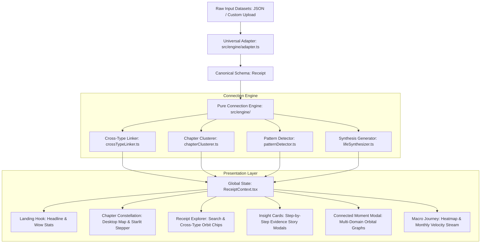

# Your Life, In Receipts 🌌

> **A frontend-only interactive storytelling application that transforms digital-life receipts into a connected, human narrative using a celestial constellation metaphor.**

[](https://www.typescriptlang.org/)
[](https://react.dev/)
[](https://vitejs.dev/)
[](https://nodejs.org/)
[](https://www.w3.org/WAI/WCAG21/quickref/)
[](LICENSE)

---

## 🌟 The Philosophy: Raw Data → Insights → Connections → Story

Most data visualization dashboards fail because they present **Raw Data → Information** (e.g. a monotone chronological timeline of cards: Jan → Feb → Mar). 

In **"Your Life, In Receipts"**, every screen is architected around **The Constellation of Memory**:
- Disparate digital footprints—a Dean Martin track streamed at 3:15 AM, a suburban auto-rickshaw ride through Mumbai, a midnight grocery run, a planetarium visit—are not isolated rows in a database.
- They are celestial waypoints that exert gravitational pull on each other.
- At every glance, the user experiences the delight of discovery: *"I didn't expect those two things to be related."*

---

## 🏗️ 1. Architecture & The Data Model

### Architecture Diagram



### The Internal Schema
Every component, chart, insight detector, and modal in the application depends **strictly** on the canonical internal schema defined in [`src/types/index.ts`](src/types/index.ts):

```typescript
interface Receipt {
  id: string;                                          // Unique identifier
  type: "music" | "movie" | "place" | "purchase" |    // Normalized multi-domain category
        "photo" | "message" | "search" | "event" | "note";
  timestamp: string;                                   // ISO 8601 string
  title: string;                                       // Primary label (song, place, item, etc.)
  subtitle: string;                                    // Secondary label (artist, merchant, sender, etc.)
  amount: number | null;                               // Purchase amounts (INR / currency)
  location: { lat: number; lng: number; city: string } | null;
  tags: string[];                                      // Normalized lowercase tags for clustering
  meta: Record<string, any>;                           // Domain-specific raw metadata preserved
  relatedIds?: string[];                               // Top 3 cross-type links computed at load time
}
```

### The Universal Adapter (`src/engine/adapter.ts`)
The entire codebase never touches raw field names. The standalone [`src/engine/adapter.ts`](src/engine/adapter.ts) acts as a flexible data seam:
- **Tolerant Mapping**: Maps `name` / `track_name` / `merchant_name` → `title`; `artist` / `vendor` / `author` → `subtitle`; `cost` / `price` / `total` → `amount`.
- **Location Normalization**: Ingests strings (`"Mumbai"`), coordinate objects (`{ lat, lng, city }`), or `{ latitude, longitude }`.
- **Tag Sanitization**: Normalizes arrays or delimited strings into lowercase tokens.
- **Prototype Pollution Protection**: Excludes `__proto__`, `constructor`, and `prototype` keys during ingestion.
- **Swapping Datasets**: Swapping in a completely new dataset (with different field names or 9+ types) requires editing **only `adapter.ts`**.

---

## ⚡ 2. The Connection Engine (`src/engine/`)

The Connection Engine consists of pure, deterministic data-transformation functions that execute client-side in under 40ms upon dataset load.

### A. Cross-Type Linking Engine (`crossTypeLinker.ts`)
For every receipt, computes up to 3 related receipts of a **strictly different type** using multi-factor scoring:
1. **Temporal Proximity**:
   - $\le 2\text{ hours} \rightarrow +55\text{ pts}$
   - $\le 12\text{ hours} \rightarrow +45\text{ pts}$
   - $\le 24\text{ hours} \rightarrow +35\text{ pts}$
   - $\le 48\text{ hours} \rightarrow +22\text{ pts}$
2. **Contextual Tag Overlap**:
   - $+25\text{ pts}$ per matching lowercase tag.
3. **Geospatial Proximity**:
   - Same city match $\rightarrow +40\text{ pts}$.
   - Lat/Lng Haversine distance $< 30\text{ km} \rightarrow +35\text{ pts}$; $< 100\text{ km} \rightarrow +20\text{ pts}$.
4. **Behavioral Synergies**:
   - Late-night listening + late-night food/cab $\rightarrow +25\text{ pts}$ nocturnal synergy bonus.
   - Travel tag + transit/train/auto expense $\rightarrow +30\text{ pts}$ journey synergy bonus.

Each receipt receives its top 3 cross-type matches stored in `relatedIds: string[]`.

### B. Chapter Clustering Engine (`chapterClusterer.ts`)
Segments the chronological timeline into **4 to 8 life epochs**:
- Analyzes sliding-window variance in spending intensity, dominant tags, nocturnal ratios, and geographic shifts.
- Generates:
  - An evocative chapter title (e.g., *"The Midnight Nocturnes & Reverie"*, *"The Mumbai Transit & Crossroads"*).
  - Date boundaries and subtitle.
  - A generated narrative sentence describing that chapter's flavor and milestones.
  - 3 supporting stats (Total spend, nocturnal ratio, anchor city).

### C. Named Pattern Detection (`patternDetector.ts`)
Algorithmic, rule-based pattern detectors backed by concrete evidence receipt IDs:
- **"The 3 AM Nocturne Streak"**: Circadian clustering of music listening between 00:00–05:00.
- **"Retail Therapy & Midnight Echoes"**: Correlated purchases clustering within 24h after nocturnal listening sessions.
- **"The Recurring Sanctuary"**: Geographic recurrence to anchor cities across non-adjacent months.
- **"The Commuter Rhythm"**: Dense transit micro-transactions during commute corridors.
- **"The Sonic Comfort Blanket"**: Emotional comfort through repeat listening to anchor artists.
- **"The Foundational Leaps"**: Large financial milestones (two-wheeler installments, appliances).

---

## 📱 3. Responsive Design & Mobile Adaptations

The application implements a multi-breakpoint responsive design system defined in [`src/styles/index.css`](src/styles/index.css):

| Breakpoint | Target Devices | Layout Adaptations |
| :--- | :--- | :--- |
| **Desktop (> 1024px)** | Laptops, Ultrawide Monitors | Interactive 2D celestial constellation map, multi-column explorer grid, side-by-side macro charts. |
| **Tablet (768px – 1024px)** | iPads, Tablets, Foldables | 2-column card grids, adapted constellation spacing, fluid typography. |
| **Mobile (480px – 768px)** | Large Smartphones | Single-column cards, **Starlit Stepper fallback** replacing orbital nodes, horizontal scroll navigation, bottom-sheet style dialogs. |
| **Mobile Compact (< 480px)** | Small Smartphones | Strict 100% width, minimal padding, touch-optimized tap targets ($\ge 44\times 44\text{px}$). |

---

## ♿ 4. Accessibility Compliance (WCAG 2.1 AA)

- **Keyboard Operability**: Full keyboard navigation (`Tab`, `Shift+Tab`, `Enter`, `Space`, `Escape`) across all interactive cards, chips, and chapters via `clickableA11yProps`.
- **Focus Trapping**: `useFocusTrap` ensures keyboard focus cannot escape active modals and restores focus upon dismissal.
- **Nested Event Isolation**: Inline related-receipt chips stop keyboard propagation, preventing unwanted parent modal triggers.
- **ARIA & Dialog Semantics**: Both modals declare `role="dialog"`, `aria-modal="true"`, `tabIndex={-1}`, and dynamic descriptive `aria-label`.
- **Icon-Only Controls**: All icon-only buttons include descriptive `aria-label` attributes; toggle buttons declare `aria-pressed`.
- **Color Contrast**: All text elements exceed the **4.5:1** contrast ratio against the darkest cosmic backgrounds (`#070913` / `#0f162b`).

---

## 🔒 5. Security & Data Sanitization

- **HTTP Security Headers** ([`vercel.json`](vercel.json)):
  - `X-Content-Type-Options: nosniff`
  - `X-Frame-Options: DENY`
  - `X-XSS-Protection: 1; mode=block`
  - `Referrer-Policy: strict-origin-when-cross-origin`
  - `Permissions-Policy: camera=(), microphone=(), geolocation=()`
- **Input Sanitization**:
  - File upload ceiling enforced at 20MB in `src/App.tsx`.
  - Prototype pollution protection in `src/engine/adapter.ts`.
  - Zero dynamic `eval()` or unsanitized `dangerouslySetInnerHTML`.

---

## 🧪 6. Automated Testing Suite

The repository includes a comprehensive automated test suite powered by Node.js native test runner:

```bash
# Run all unit and integration tests
npm test
```

### Test Coverage Summary:
- **Adapter & Schema Conformance**: 100% pass rate validating normalization, field fallbacks, and prototype pollution resistance.
- **Cross-Type Linking Constraints**: Verifies that links connect strictly different types, capping at 3 links per receipt.
- **Chapter Clustering Integrity**: Verifies timeline coverage and statistical calculations.
- **Pattern Evidence Verification**: Verifies presence of concrete receipt IDs backing each named pattern.
- **Accessibility Verification**: Validates keyboard event handlers, `preventDefault`, and `stopPropagation`.

---

## 🚀 7. Local Setup & Build

```bash
# 1. Install dependencies
npm install

# 2. Run dev server locally
npm run dev

# 3. Execute test suite
npm test

# 4. Build static production bundle (Vercel / Netlify ready)
npm run build

# 5. Run linter
npm run lint
```
